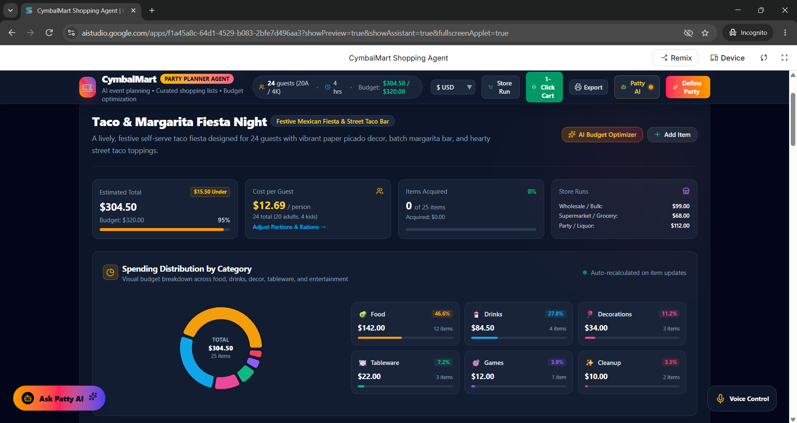

# 🛍️ CymbalMart AI Shopping Assistant

An intelligent, interactive shopping assistant powered by **Google AI Studio** and advanced Gemini models. It provides users with personalized product recommendations, detailed item specifications, and an immersive e-commerce conversational experience.

---

## 📸 Application Screenshot

> *Live view of the CymbalMart AI Shopping Agent interface:*

---

## 🏗️ Architecture & Features

* **Intelligent Product Discovery:** Leverages LLM reasoning to recommend items based on user preferences, budget constraints, and specific use cases.
* **Conversational Shopping Agent:** Allows users to ask clarifying questions about product specs, compatibility, and deals in real-time.
* **Google AI Studio Integration:** Built and prototyped directly inside Google AI Studio, leveraging multi-turn context for seamless shopping guidance.

---

## 🚀 Live Demo & Access

Experience the application live:
👉 **[Launch CymbalMart AI Shopping Agent](https://aistudio.google.com/apps/f1a45a8c-64d1-4529-b083-2bfe7d496aa3?showPreview=true&showAssistant=true)**

---

## 🛠️ Usage & Development

1. Open the [AI Studio App Link](https://aistudio.google.com/apps/f1a45a8c-64d1-4529-b083-2bfe7d496aa3?showPreview=true&showAssistant=true).
2. Interact with the assistant by typing your shopping inquiries or selecting preset prompts.
3. Review personalized item suggestions an
